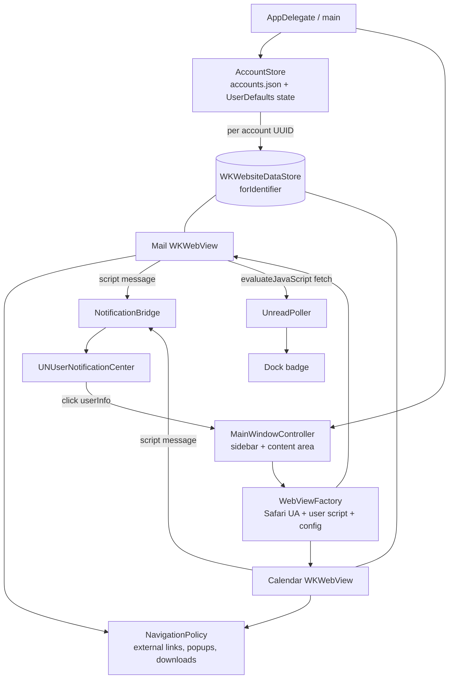
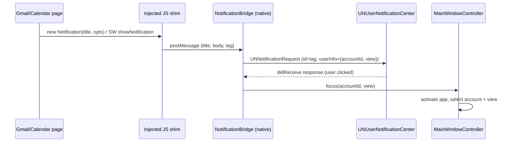

# MailSpace v1 - Plan

## Goal Capsule

- **Objective:** Vitalii retires Mailplane: one native macOS app where he reads Gmail and Google Calendar for multiple fully isolated Google accounts, with working Google login, native new-mail and calendar notifications that focus the right account, and a Dock unread badge.
- **Means:** WKWebView wrapper app — Swift + AppKit, one `WKWebsiteDataStore(forIdentifier:)` per account, Safari user agent (KTD1, KTD3, KTD4).
- **Authority:** this plan > `docs/mailspace-requirements.md` > `docs/research-mailplane-competitors.md` > implementer judgment on details the plan leaves open.
- **Stop conditions:** Google login still returns `disallowed_useragent` after the Safari-UA workaround of KTD4 and its popup fallback — stop and report; do not invent an OAuth/API client (out of scope). Any evidence a session-settled decision cannot work — report, do not silently substitute.
- **Execution profile:** single implementation pass on a local branch, merged locally to `main`; no remote, no CI, no distribution.

---

## Product Contract

### Summary

Build MailSpace, a personal macOS 14+ app that wraps the Gmail and Google Calendar web UIs. Each Google account gets its own persistent, isolated WebKit session. A light-chrome window with an account sidebar switches between account × (mail | calendar) views. A JS shim bridges the web Notification API to native macOS notifications; a Gmail atom-feed poller drives the Dock unread badge. Built headlessly from the CLI with Swift Package Manager plus a bundle-assembly Makefile, ad-hoc signed, never distributed.

### Problem Frame

Mailplane is discontinued and misbehaving (frozen calendars, mail glitches). Alternatives are Electron-heavy, subscription-based, or drop Calendar/multi-account (see origin and `docs/research-mailplane-competitors.md` §2). A minimal personal wrapper on WKWebView is proven viable in 2025-2026 (Unite, Boxy, Kiwi).

### Requirements

**Webviews and login**
- R1. Gmail and Google Calendar full web UIs load inside the app, not an external browser.
- R2. Google web login (`accounts.google.com`) succeeds inside the app's webviews.

**Accounts**
- R3. Multiple accounts, each a fully isolated session (own cookies/storage) — no Gmail `/u/N` switching.
- R4. Switching accounts and views takes one click or one keyboard shortcut (Cmd+1..9 for accounts).

**Notifications and badge**
- R5. New mail fires a native macOS notification, per account.
- R6. Calendar event reminders fire native macOS notifications.
- R7. Clicking a notification activates the app on the originating account and view.
- R8. Dock icon shows total unread count across all accounts.

**UI and identity**
- R9. App chrome is light-toned, matching light Gmail/Calendar.
- R10. App icon is a proper `.icns` generated from `assets/icon-1024.png` and wired into the bundle.
- R11. Within an account, Mail and Calendar are switchable views (account × view, Mailplane-style).

**Browser behavior**
- R12. Links to non-Google domains open in the default external browser; Google domains stay in-app.
- R13. Gmail attachment downloads land in `~/Downloads` and open correctly.
- R14. Window size/position and last active account/view persist across restarts.
- R15. Gmail's and Calendar's own keyboard shortcuts pass through unswallowed; app shortcuts avoid keys the web apps use.
- R16. The app can register as the `mailto:` handler; a `mailto:` link opens Gmail compose in the last-active account.

**Build and packaging**
- R17. The app builds and runs headlessly from the CLI (no Xcode GUI), ad-hoc signed only.

### Key Decisions

- **Native WKWebView wrapper, not Electron and not an API client** (session-settled: user-directed — chosen over Electron and over a Gmail-API client like Mimestream: WebKit is the least-blocked engine for Google login, memory-light, and the full Gmail/Calendar web UI is the product). Governs R1, R2. (see origin: docs/mailspace-requirements.md)
- **v1 scope = research §5 "Core (v1)" + origin Must + Should have.** Explicitly out: offline mail, IMAP, dark theme, publishing/updates/licensing. Governs Scope Boundaries. (see origin: docs/mailspace-requirements.md)

### Scope Boundaries

**Deferred to Follow-Up Work** (v2, research §5)
- Cross-account search, notification quick actions (archive/reply from banner), per-account notification settings (Primary-only filter), dark-mode CSS injection, userscript/plugin slots, menu-bar unread count.

**Outside this product's identity**
- Offline mail, own mail engine, IMAP, Gmail API/OAuth client, custom mail UI, App Store/notarized distribution, multi-user.

### Acceptance Examples

- AE1. **Covers R2, R3.** Given accounts "Work" and "Personal" added, when the user signs into a different Google identity in each, then both stay signed in simultaneously and neither session sees the other's cookies after app restart.
- AE2. **Covers R5, R7.** Given the app is running with the "Work" account's mail view in the background, when a new email arrives in Work's inbox, then a macOS notification appears; clicking it brings MailSpace frontmost showing Work's mail view.
- AE3. **Covers R12.** Given an email containing a link to `example.com`, when the user clicks it, then it opens in the default browser and the in-app view does not navigate away.

### Sources

- `docs/mailspace-requirements.md` — origin requirements.
- `docs/research-mailplane-competitors.md` — §3 (UA workaround, Notification shim, atom feed, `WKWebsiteDataStore(forIdentifier:)`), §5 (v1 feature set). Load-bearing for KTD3-KTD6.
- Reference implementations to mine when stuck: `charlierobin/google-mail-wrapper` (minimal WKWebView Gmail wrapper), `kfix/MacPin` (JS↔native bridging), `timche/gmail-desktop` (feature behavior).

---

## Planning Contract

### Key Technical Decisions

- KTD1. **Pure AppKit, programmatic UI — no SwiftUI, no storyboards/xibs.** WKWebView is AppKit-native; programmatic NSWindow/NSView avoids resource compilation in the headless build and keeps first-responder/shortcut handling predictable. SwiftUI wrapping (NSViewRepresentable) adds focus and lifecycle indirection for zero gain in a webview-hosting app.
- KTD2. **SPM executable + Makefile bundle assembly, not xcodegen + xcodebuild.** `swift build` produces the arm64 binary; a Makefile assembles `MailSpace.app` (Contents/MacOS binary, Info.plist, Resources/AppIcon.icns), generates the icns via `sips` + `iconutil`, and ad-hoc signs with `codesign -s -`. Zero extra tool dependencies (xcodegen is not installed), fully scriptable, satisfies R17. The binary must run from inside the bundle — `UNUserNotificationCenter` and Dock badging require a signed app bundle, not a bare executable.
- KTD3. **One `WKWebsiteDataStore(forIdentifier: UUID)` per account** (macOS 14+ API). The app persists the UUID→account mapping itself in `~/Library/Application Support/MailSpace/accounts.json`; deleting an account calls `WKWebsiteDataStore.remove(forIdentifier:)`. An account's mail and calendar webviews share one `WKWebViewConfiguration` (same data store + process pool) so Gmail and Calendar share the account's Google session.
- KTD4. **Safari desktop UA via `customUserAgent`, one bumpable constant.** `Mozilla/5.0 (Macintosh; Intel Mac OS X 10_15_7) AppleWebKit/605.1.15 (KHTML, like Gecko) Version/17.6 Safari/605.1.15` per research §3. Engine is genuinely WebKit, so the result is indistinguishable from Safari. Fallback if a login flow still balks: let the flow complete in an in-app popup window on the same data store (KTD7 handles popups).
- KTD5. **Notification bridging via injected `WKUserScript` at `.atDocumentStart` (all frames).** The script defines a fake `Notification` class (constructor + `requestPermission` resolving `"granted"`, `permission = "granted"`) and overrides `ServiceWorkerRegistration.prototype.showNotification`, forwarding `{title, body, tag}` through a `WKScriptMessageHandler`. Native side attaches `{accountId, view}` and posts to `UNUserNotificationCenter`, using the web `tag` as notification identifier for dedup. Notification click routes through `UNUserNotificationCenterDelegate` userInfo back to the owning account/view. The JS ships as a Swift multiline string constant — no resource-bundle plumbing in the hand-assembled app bundle.
- KTD6. **Unread badge from the Gmail atom feed, fetched inside the mail webview.** Every 60s per account, run `callAsyncJavaScript` awaiting the text of `fetch('https://mail.google.com/mail/feed/atom')` in that account's mail webview — same-origin, session cookies apply automatically, no cookie copying. (`callAsyncJavaScript` resolves returned promises; plain `evaluateJavaScript` would hand back a pending Promise as nil.) Parse `<fullcount>` natively, sum across accounts into `NSApp.dockTile.badgeLabel` (empty when 0). A failed or 401 fetch (not yet logged in) counts as 0 for that account and does not surface errors. New-mail *notifications* come from KTD5, not the feed.
- KTD7. **Navigation policy in one delegate.** `decidePolicyFor navigationAction`: user-clicked links to non-Google hosts → `NSWorkspace.shared.open` + `.cancel`; Google-family hosts (`google.com` and subdomains, `googleusercontent.com`, `gstatic.com`, `youtube.com` stays external) → `.allow`. `createWebViewWith` (target=_blank / window.open): Google-family → transient child NSWindow whose webview is initialized with the exact `configuration` object WebKit passes into the delegate call — required, any other configuration raises `NSInternalInconsistencyException`; the passed one already inherits the account's data store, so login/print popups keep the session. Everything else → external browser, return nil.
- KTD8. **All account webviews are created eagerly at launch and kept alive.** Background accounts must keep receiving web notifications (R5, R6) and answering feed polls (R8); switching is instant view-swapping of retained webviews in the window's content area. Memory cost accepted for a personal app with a handful of accounts. The shared navigation delegate implements `webViewWebContentProcessDidTerminate` → `reload()`, so a background account whose WebContent process macOS reclaims under memory pressure comes back automatically (notifications and polling resume) instead of dying silently.
- KTD9. **Verification posture: build gate + scripted smoke + manual checklist; XCTest only for pure logic** (atom feed parsing, account-store JSON round-trip). No UI-test pyramid for a webview wrapper — login, notifications, and badge are verified manually per the Verification Contract.

### High-Level Technical Design

Component topology:



Notification round-trip:



### Assumptions

Headless run — inferred bets recorded instead of asked:

- **Sidebar over top tabs.** Origin allows "tabs or sidebar"; a vertical account sidebar (accounts with Mail/Calendar rows) is chosen — simpler in programmatic AppKit than a custom tab strip.
- **Eager webview loading (KTD8)** trades memory for reliable background notifications; acceptable at personal account counts (2-4).
- **Menu-bar unread count** (research lists it as optional) is deferred to v2.
- **Contacts view** (Mailplane had one) is not in origin requirements — excluded.
- **Bundle id `com.vitalii.MailSpace`**; deployment target macOS 14.0 (`platforms: [.macOS(.v14)]`) even though the dev machine runs macOS 15.
- **App shortcuts**: Cmd+1..9 = accounts, Cmd+Shift+M / Cmd+Shift+K = mail/calendar view, Cmd+N reserved for Gmail compose passthrough is NOT taken — app uses menu items only for keys Gmail/Calendar don't use (R15).

### Risks

- **Google tightens embedded-login detection beyond UA** (what killed Mailplane commercially). Mitigation: KTD4's UA constant is a one-line bump; WebKit-genuine engine keeps detection surface minimal; popup fallback via KTD7. Residual risk accepted for a personal app.
- **Gmail atom feed retired.** Working as of 2026 (research §3). Fallback if it dies: derive unread count from the shim's notification stream or scrape the inbox title via `evaluateJavaScript` — deferred until it actually breaks.
- **Web notifications require each account's Gmail "Desktop notifications" setting ON** and the calendar webview loaded. KTD8 (eager, kept-alive webviews) covers the latter; the manual checklist covers the former.
- **Orphaned data stores** if `accounts.json` is lost while `~/Library/WebKit` stores remain. Acceptable for personal use; `WKWebsiteDataStore.fetchAllDataStoreIdentifiers` cleanup is a v2 nicety.

### Sequencing

U1 → U2 → U3 → {U4, U5, U6, U7 in any order}. One branch, one local merge; units land as separate commits.

---

## Output Structure

```text
mailspace/
├── Package.swift
├── Makefile                        # build | bundle | icon | sign | run | smoke | clean
├── Sources/MailSpace/
│   ├── main.swift                  # NSApplication bootstrap
│   ├── AppDelegate.swift           # menus, mailto handler, activation
│   ├── Account.swift               # model: id (UUID), name, lastView
│   ├── AccountStore.swift          # accounts.json + UserDefaults persistence
│   ├── WebViewFactory.swift        # config, UA constant, user script injection
│   ├── AccountSession.swift        # per-account data store + mail/calendar webviews
│   ├── MainWindowController.swift  # window, sidebar, content swap, shortcuts
│   ├── NavigationPolicy.swift      # link routing, popups, WKDownloadDelegate
│   ├── NotificationShim.swift      # the injected JS as a string constant
│   ├── NotificationBridge.swift    # WKScriptMessageHandler + UN delegate
│   ├── UnreadPoller.swift          # 60s feed polling, badge aggregation
│   └── AtomFeedParser.swift        # <fullcount> extraction (pure)
├── Tests/MailSpaceTests/
│   ├── AtomFeedParserTests.swift
│   └── AccountStoreTests.swift
├── Resources/
│   └── Info.plist                  # template copied into the bundle
├── scripts/
│   ├── make-icns.sh                # sips + iconutil from assets/icon-1024.png
│   └── smoke.sh                    # bundle/sign/launch checks
└── assets/icon-1024.png            # existing
```

---

## Implementation Units

### U1. Project scaffold, build pipeline, and app icon

- **Goal:** `make build` produces a signed, launchable `MailSpace.app` with the correct icon, from a clean checkout, without Xcode GUI.
- **Requirements:** R10, R17
- **Dependencies:** none
- **Files:** `Package.swift`, `Makefile`, `Sources/MailSpace/main.swift`, `Sources/MailSpace/AppDelegate.swift`, `Resources/Info.plist`, `scripts/make-icns.sh`, `scripts/smoke.sh`
- **Approach:**
  1. `Package.swift`: single executable target `MailSpace`, `platforms: [.macOS(.v14)]`, no external dependencies.
  2. `main.swift` + minimal `AppDelegate`: NSApplication with `.regular` activation policy, one empty NSWindow, a standard main menu (Quit, Close, Edit menu for copy/paste in webviews later).
  3. `Makefile`: `swift build -c release` → assemble `build/MailSpace.app/Contents/{MacOS,Resources}`; render `Info.plist` (CFBundleIdentifier `com.vitalii.MailSpace`, CFBundleName, CFBundleIconFile AppIcon, LSMinimumSystemVersion 14.0, NSPrincipalClass NSApplication, NSHighResolutionCapable, CFBundleURLTypes for `mailto` — inert until U7); `codesign --force -s - build/MailSpace.app`; `make run` = `open build/MailSpace.app`.
  4. `scripts/make-icns.sh`: `sips` resizes `assets/icon-1024.png` into an `AppIcon.iconset` (16→1024 incl. @2x), `iconutil -c icns` → bundled `AppIcon.icns`.
  5. `scripts/smoke.sh`: assert bundle layout, `plutil -lint` the Info.plist, `codesign --verify`, launch via `open`, poll `pgrep` for the process staying alive ~5s, then quit it.
- **Execution note:** packaging/config unit — prove it with `make build && make smoke`, not unit tests.
- **Test scenarios:** Test expectation: none — pure scaffolding/packaging; `scripts/smoke.sh` is the proof.
- **Verification:** clean checkout → `make build` exits 0; `make smoke` passes; app appears in Dock with the envelope/calendar icon; Cmd+Q quits.

### U2. Accounts, isolated sessions, and Google login

- **Goal:** Accounts can be added/removed; each gets an isolated persistent session; Google login succeeds and survives restart.
- **Requirements:** R1, R2, R3
- **Dependencies:** U1
- **Files:** `Sources/MailSpace/Account.swift`, `Sources/MailSpace/AccountStore.swift`, `Sources/MailSpace/WebViewFactory.swift`, `Sources/MailSpace/AccountSession.swift`, `Tests/MailSpaceTests/AccountStoreTests.swift`
- **Approach:**
  1. `Account`: Codable `{id: UUID, name: String, lastView: mail|calendar}`. `AccountStore` loads/saves `accounts.json` under `~/Library/Application Support/MailSpace/` (create dir on first run), exposes add/remove (sidebar order = creation order; no reordering in v1). Removal ordering matters: first detach and release the account's mail/calendar webviews and any child popup windows (the store cannot be removed while in use), then call `WKWebsiteDataStore.remove(forIdentifier:)` (KTD3), logging — not crashing — on error.
  2. `WebViewFactory`: builds one `WKWebViewConfiguration` per account — `WKWebsiteDataStore(forIdentifier: account.id)`, shared process pool, user script slot (filled in U5) — and webviews with `customUserAgent` set to the KTD4 constant.
  3. `AccountSession`: owns the account's mail webview (`https://mail.google.com/`) and calendar webview (`https://calendar.google.com/`), created eagerly (KTD8).
  4. "Add Account" menu item + first-launch path: prompt for a display name (simple NSAlert with accessory text field is enough), create the account, show its mail webview → Google login page renders in it.
- **Patterns to follow:** research §3 session-isolation section; `charlierobin/google-mail-wrapper` for minimal WKWebView setup.
- **Test scenarios:**
  - AccountStore round-trip: add two accounts, save, reload → identical ids, names, order.
  - Remove account → accounts.json no longer contains it.
  - Corrupt/missing accounts.json → store starts empty without crashing.
- **Verification:** Covers AE1. Add "Work" and "Personal"; log into two different Google identities; no "This browser or app may not be secure" error (R2); quit and relaunch → both still signed in; cookies do not leak between accounts (each shows its own inbox).

### U3. Main window: sidebar, view switching, shortcuts, persistence, light chrome

- **Goal:** One window with an account sidebar; account × (mail|calendar) switching by click and shortcut; state persists.
- **Requirements:** R4, R9, R11, R14, R15
- **Dependencies:** U2
- **Files:** `Sources/MailSpace/MainWindowController.swift`, `Sources/MailSpace/AppDelegate.swift` (menu wiring)
- **Approach:**
  1. Window: `NSWindow` with `frameAutosaveName` (R14 frame half); content = horizontal split of a fixed ~200pt sidebar and the active webview.
  2. Sidebar: light `NSVisualEffectView`/plain light background (R9), a vertical stack per account: account name header + "Mail" / "Calendar" rows; click selects; selected row highlighted. Plus an "Add Account" row. Right-click on an account row offers "Remove Account…" behind a confirmation alert (removal deletes the account's session data per U2).
  2a. Zero-accounts state (first launch, or all accounts removed): sidebar shows only the Add Account row; content pane shows a centered "Add your first account" prompt. No auto-popped dialog; Cancel in the add dialog returns to this state unchanged.
  3. Switching swaps the retained webview into the content area (never reloads); persists `{lastAccountId, account.lastView}` via UserDefaults and restores on launch (R14).
  4. Menus: "Accounts" menu with each account at Cmd+1..9; "View" menu with Mail (Cmd+Shift+M) and Calendar (Cmd+Shift+K). No shortcuts that Gmail/Calendar use as single-key or Cmd-letter essentials — verify Cmd+Shift+M/K do nothing in Gmail before finalizing; if taken, pick free equivalents (R15).
- **Test scenarios:**
  - Cmd+2 switches to the second account's last-used view.
  - Switching mail → calendar → mail preserves scroll/compose state (webviews retained, no reload).
  - Relaunch restores window frame, last account, and last view.
  - Typing in Gmail (e.g. "c" for compose, Cmd+Enter to send) reaches Gmail unmodified.
  - First launch with zero accounts shows the add-first-account prompt; Cancel returns to it without crashing.
  - Remove Account via context menu asks for confirmation, then the account leaves the sidebar and its session data is gone after relaunch.
- **Verification:** manual pass of the scenarios above with two accounts; chrome visibly light-toned next to light Gmail.

### U4. Navigation policy: external links, popups, downloads

- **Goal:** Non-Google links open externally; Google popups (login, print) work in-app; attachments download to `~/Downloads`.
- **Requirements:** R12, R13
- **Dependencies:** U2
- **Files:** `Sources/MailSpace/NavigationPolicy.swift`, `Sources/MailSpace/AccountSession.swift` (delegate wiring)
- **Approach:** implement KTD7 in one `WKNavigationDelegate`/`WKUIDelegate` pair shared by all webviews; plus `WKDownloadDelegate`: `navigationResponse` with non-displayable MIME or `shouldPerformDownload` → download; destination `~/Downloads/<name>`, appending ` (2)` etc. on collision. No completion UI in v1 — the file simply lands in `~/Downloads` (the Dock-stack bounce relies on a private distributed notification that is unreliable on modern macOS).
- **Test scenarios:**
  - Covers AE3. Click `example.com` link in an email → default browser opens it; webview stays put.
  - Google account-chooser popup during login opens as an in-app child window and completes login.
  - Download a Gmail attachment → file lands in `~/Downloads`, opens, correct byte size.
  - Two downloads with the same filename → second gets a suffixed name.
- **Verification:** manual pass of all four scenarios.

### U5. Native notifications: JS shim and bridge

- **Goal:** Gmail new-mail and Calendar reminder web notifications surface as native macOS notifications; clicking one focuses the right account/view.
- **Requirements:** R5, R6, R7
- **Dependencies:** U2, U3 (focus routing needs the window controller)
- **Files:** `Sources/MailSpace/NotificationShim.swift`, `Sources/MailSpace/NotificationBridge.swift`, `Sources/MailSpace/WebViewFactory.swift` (inject script)
- **Approach:** implement KTD5.
  1. Shim (JS string): define `window.Notification` (constructor stores title/options, fires `postMessage` to handler `notify`; static `permission = 'granted'`; `requestPermission` resolves `'granted'`), override `ServiceWorkerRegistration.prototype.showNotification` the same way. Inject `.atDocumentStart`, `forMainFrameOnly: false`.
  2. Bridge: one `WKScriptMessageHandler` per account (or one shared, with per-webview account lookup); builds `UNNotificationRequest` — identifier = web `tag` (fallback UUID), userInfo `{accountId, view}`, content `subtitle` = the account's display name so banners visibly identify the originating account (userInfo alone only routes clicks, it displays nothing); requests `UNUserNotificationCenter` authorization once at first launch.
  3. `UNUserNotificationCenterDelegate`: present banners while app is frontmost (`.banner`); `didReceive` → activate app, select account + originating view (mail for Gmail, calendar for Calendar).
  4. In Gmail settings the user enables "Desktop notifications"; the shim auto-grants permission so Gmail's setting toggle works.
- **Execution note:** verify first — before building the rest of the unit — that Gmail's and Calendar's notifications actually flow through the page-context shim: a `showNotification` call made from inside a service worker's own global scope is unreachable by injected user scripts. If either app bypasses the shim, fall back to feed-diff notifications for mail and re-plan calendar reminders.
- **Patterns to follow:** research §3 notification-bridging section and its linked WKWebView capture guide; `kfix/MacPin` for message-handler shape.
- **Test scenarios:**
  - Covers AE2. Send a test email to an account while another account's view is frontmost → notification names the right account; click focuses that account's mail view.
  - Calendar reminder (create event 1 minute out with popup reminder) → native notification fires from the background calendar webview; click focuses that account's calendar view.
  - Duplicate `tag` from Gmail → notification replaces, not stacks.
  - Notification with no `tag`/body → still posts with title only, no crash.
- **Verification:** manual pass of the scenarios; first launch shows the macOS notification-permission prompt exactly once per signed build (ad-hoc signatures are per-build cdhash, so a rebuild may legitimately re-prompt).

### U6. Dock unread badge

- **Goal:** Dock badge shows the total unread count across accounts, updating within ~60s.
- **Requirements:** R8
- **Dependencies:** U2
- **Files:** `Sources/MailSpace/UnreadPoller.swift`, `Sources/MailSpace/AtomFeedParser.swift`, `Tests/MailSpaceTests/AtomFeedParserTests.swift`
- **Approach:** implement KTD6 — per-account 60s timer running the same-origin `fetch` of `/mail/feed/atom` via `callAsyncJavaScript` (KTD6) in that account's mail webview; `AtomFeedParser` (pure function, XMLParser or line scan) extracts `<fullcount>`; aggregate to `NSApp.dockTile.badgeLabel`, blank at 0. Also refresh immediately after a U5 new-mail notification for snappier badges.
- **Test scenarios:**
  - Parser: valid feed with `<fullcount>7</fullcount>` → 7.
  - Parser: fullcount 0 → 0; missing fullcount / HTML login page / empty string → nil (treated as 0 by the poller).
  - Poller integration (manual): mark all read in Gmail → badge clears within a minute; new unread → badge increments; logged-out account contributes 0 without error spam.
- **Verification:** `swift test` green for parser; manual badge behavior with two accounts (sum is across accounts).

### U7. mailto: handler

- **Goal:** MailSpace can be the system `mailto:` handler; clicking a mailto link opens Gmail compose in the last-active account.
- **Requirements:** R16
- **Dependencies:** U2, U3
- **Files:** `Sources/MailSpace/AppDelegate.swift`, `Resources/Info.plist` (CFBundleURLTypes already present from U1)
- **Approach:** handle the URL open event (`application(_:open:)`). Buffer the incoming mailto URL when it arrives before the last-active account's mail webview has committed its initial navigation (cold launch), then URL-encode the full payload into `https://mail.google.com/mail/?extsrc=mailto&url=<encoded>` and load it in that webview, bringing the app frontmost (research §5 item 6). Fallback if Gmail retires `extsrc`: map to `?view=cm&to=…&su=…&body=…`. With zero accounts, show the U3 zero-accounts prompt instead. Include a "Make Default Mail App" menu item using `NSWorkspace.shared.setDefaultApplication(at:toOpenURLsWithScheme:)` (macOS 12+; `LSSetDefaultHandlerForURLScheme` is deprecated).
- **Test scenarios:**
  - `open "mailto:a@b.com?subject=Hi"` in Terminal with app running → compose opens pre-filled in last-active account.
  - Same command with app not running → app launches, then compose opens.
  - Malformed mailto URL → app activates without crashing.
- **Verification:** manual pass of the three scenarios after "Make Default Mail App".

---

## Verification Contract

| Gate | Command | Proves |
|---|---|---|
| Build | `make build` | R17 — headless compile, bundle assembly, icns generation, ad-hoc signing |
| Smoke | `make smoke` (`scripts/smoke.sh`) | bundle layout, Info.plist lints, signature verifies, app launches and stays alive |
| Unit | `swift test` | AtomFeedParser + AccountStore pure logic |
| Manual | checklist below | everything user-facing |

Manual checklist (run once against the built app, two real Google accounts):

1. Add two accounts; log both in — no `disallowed_useragent` (R2, AE1).
2. Restart → sessions, window frame, last account/view restored (R3, R14).
3. Cmd+1/Cmd+2 and sidebar clicks switch instantly without reload (R4, R11).
4. Gmail shortcuts ("c", "/", Cmd+Enter) work inside the webview (R15).
5. Test email → native notification → click focuses right account (R5, R7, AE2).
6. Calendar reminder fires natively from a background account (R6).
7. Badge sums unread across accounts; clears when read (R8).
8. External link → default browser (R12, AE3); attachment → `~/Downloads` (R13).
9. mailto from Terminal opens compose in last-active account (R16).
10. Icon renders in Dock/Finder at multiple sizes; chrome is light (R9, R10).

## Definition of Done

- All units implemented; `make build`, `make smoke`, and `swift test` pass from a clean checkout.
- Manual checklist items 1-10 verified and noted (pass/fail per item) in the merge commit or a short note.
- No dead-end or experimental code left in the tree; no absolute user paths hardcoded (use `FileManager`/`NSHomeDirectory`).
- Branch merged locally to `main`; no remote push, no release/tag (personal, unpublished).
- Known-limitation notes recorded for anything deliberately deferred (Scope Boundaries list) rather than silently missing.
